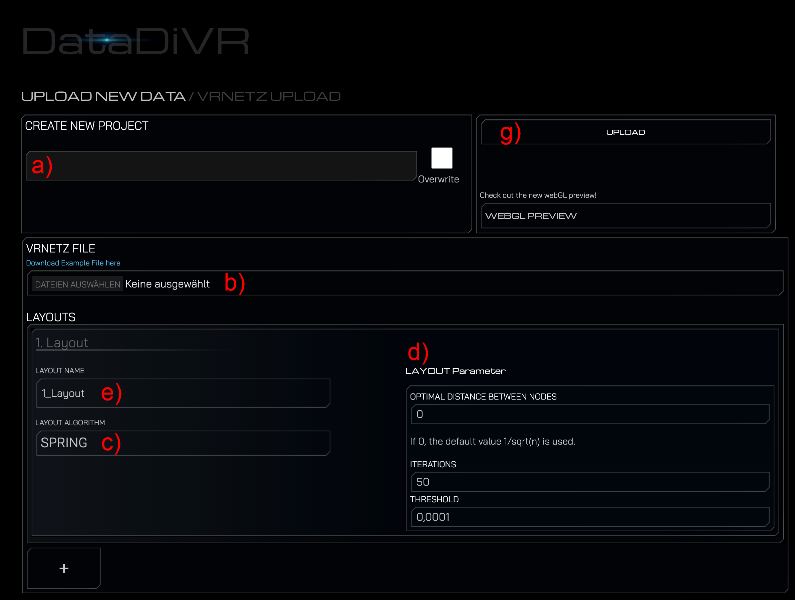

# CyEx

This extension serves as a bridge between the [DataDiVR ecosystem](https://github.com/menchelab/DataDiVR_WebApp) and the widely used network visualization software Cytoscape. In combination with the Cytoscape App [CytoDiVR](https://github.com/menchelab/CytoDiVR) this extension allows to upload and receive networks exported from Cytoscape using the CytoDiVR App.
Furthermore, it also enables to sent sub-set of a large-scale DataDiVR Project from a running DataDiVR session to a running Cytoscape session.

## Installation

1. Add the `CyEx` directory to your DataDiVR backend directory. The directory should be located at `"extensions/CyEx"`.
2. Restart your backend server.
3. During the start-up of the backend server, all the necessary Python packages needed for the extension should be automatically installed.

## Usage

### Upload network from Cytoscape

1. Export a network with the CytoDiVR from Cytoscape. For further instructions see [here](https://github.com/menchelab/CytoDiVR).
2. Start the DataDiVR backend using the script applicable to your operating system.
3. Navigate in your Browser to http://127.0.0.1:5000/CyEx/upload (Windows/Linux) / http://127.0.0.1:3000/CyEx/upload (mac)
4. If the StringEx is correctly installed, you should now see two new tabs. The first is the VRNetz designated uploader

   

5. On this website, (a) define a project name, (b) select the VRNetz file of your exported network, and (c) select the desired layout algorithm.
6. You can (d) also define the respective variables.
7. You can (e) provide a name for the generated node layout.
8. Click on the "Upload" button to upload the network to the VRNetzer platform.
9. If the upload was successful, you'll be prompted with a success message and a link to preview the project in the designated WebGL previewer.

---
